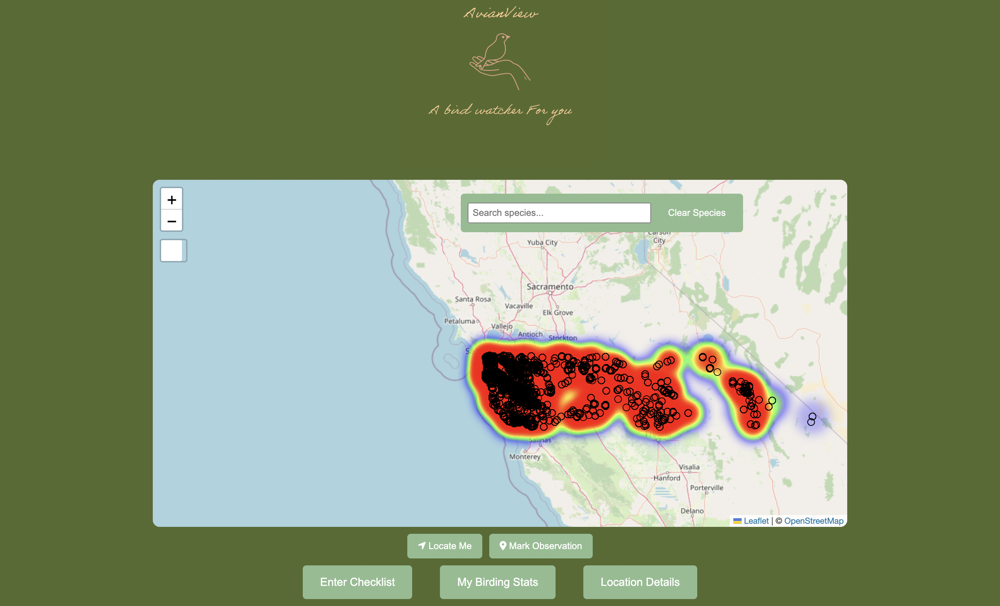
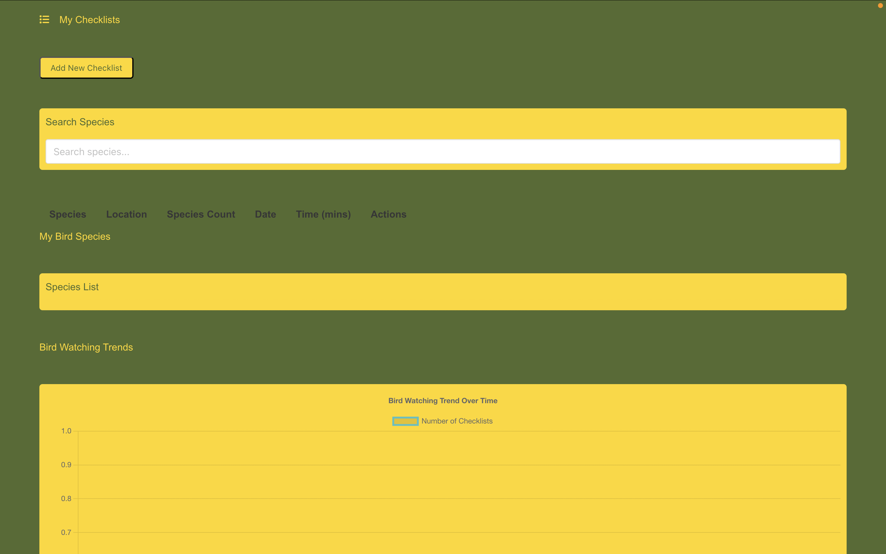

# AvianView
AvianView is a bird-watching web application that allows users to track and visualize bird sightings through interactive maps, species-specific checklists, and detailed location and personal statistics. The app enables bird watchers to log their observations, explore bird densities across regions, and gain insights into their birding activities through intuitive Vue.js-powered pages that include features like map-based sighting tracking, species selection, and personalized bird-watching filters.

## How to Access and Run the Application

### Required Libraries and Software to Run Application 
You will need the following commands/libraries to run the application:
#### Create a virtual environment
python3 -m venv avianview_env

#### Activate virtual environment
#### On Windows
avianview_env\Scripts\activate
#### On macOS/Linux
source avianview_env/bin/activate

#### Install Python dependencies
pip install py4web pydal yatl

#### Install Node.js and npm (for Vue.js)
#### Option 1: Download from nodejs.org
#### Option 2: Using package manager

#### Install Vue CLI
npm install -g @vue/cli

#### Create Vue project
vue create avianview-frontend

#### Install frontend libraries
cd avianview-frontend
npm install leaflet axios chart.js

## Brief Rundown 
This project was developed as part of a course at the University of California, Santa Cruz, focusing on practical applications of Database Management, UI/UX Design, Web Frameworks, Agile Software Development, and Web Application Architecture. We created a comprehensive bird-watching application that enables users to register, track, edit, and manage their bird sightings through an interactive platform featuring integrated mapping, data visualization, and personalized user statistics that can be dynamically updated and stored in the database.

The database we implemented was based around CSV files, and had a key word search in Models.py, and information was controlled by the controllers.py (Look for specifc guidlines and detials in the application files).

## Functionality

### Index

Greet users with an intuitive and visually compelling index page that showcases regional bird statistics through an interactive heat map displaying bird sighting densities across different areas. Users can seamlessly register for an account and explore our designed interface, which offers an engaging and informative bird-watching experience.
### Enter Checklist
Once officially signed in, users are welcomed to a comprehensive checklist page where they can effortlessly document bird sightings with precise details. The interface automatically captures location and timestamp information through user location permissions, allowing users to seamlessly add multiple bird observations to their checklist with intuitive data entry capabilities.

After submitting their checklist, users can explore their personalized statistics through interactive, data-driven visualizations that provide insights into their bird-watching activities. The statistics page offers a comprehensive, searchable interface allowing users to dive deep into their recorded species, with the ability to filter and analyze their bird sightings with ease.

### Location details

The location page serves as a comprehensive exploration hub for users curious about specific bird or regional details. Users can dive into detailed statistical visualizations through interactive bar graphs, while a competitive leaderboard enables birding enthusiasts to compare and track their sighting accomplishments across different locations.

As users scroll down, they'll discover an additional layer of insights through an informative pie chart that breaks down observation times and highlights the most frequently observed species in the selected location.

For users seeking detailed insights into a specific species, the search feature offers an unparalleled exploration experience. By selecting a species, users are immediately presented with a comprehensive view featuring a top density map and a time-based graph of sightings, revealing intricate patterns in bird population and movement—arguably the page's most compelling feature.

# About Us

We are senior Computer Science undergraduates at the University of California, Santa Cruz, with a passion for web design, practical applications, HCI development, and database management. Dedicated and hardworking, we are focused on creating innovative solutions in application development.

### Evangelos Barberis

I am Evangelos Barberis, a Computer Science graduate student at the University of California, Santa Cruz, with a dedicated focus on Human-Computer Interaction (HCI), UI, and UX design. My academic and professional pursuits are driven by a passion for creating impactful, innovative applications that blend cutting-edge design with meaningful user experiences.

In the AvianView project, I played a pivotal role in developing and implementing key application components, including the index, checklist, user statistics, and location pages. My contributions extended beyond functionality to a holistic design approach, encompassing seamless visual integration of maps and graphs, a custom color scheme, original logo design, and robust database management and data retrieval strategies.

### Kevin Situ

